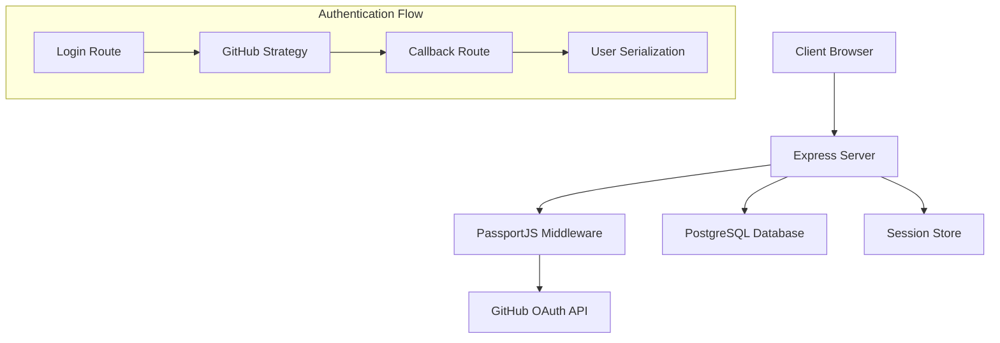

# Design Document

## Overview

This design implements GitHub OAuth authentication for the Flownity backend using a modern Node.js/TypeScript stack with Express.js, PassportJS, and PostgreSQL. The architecture follows RESTful principles and implements secure session management with minimal user data storage.

## Architecture

### High-Level Architecture



### Technology Stack Integration

- **Express.js 5.x**: HTTP server and routing
- **PassportJS**: Authentication middleware with GitHub strategy
- **passport-github2**: GitHub OAuth 2.0 strategy implementation
- **PostgreSQL**: User data persistence
- **express-session**: Session management
- **TypeScript**: Type safety and development experience

## Components and Interfaces

### 1. Authentication Middleware

**PassportJS Configuration**
- GitHub OAuth 2.0 strategy setup
- User serialization/deserialization for sessions
- Route protection middleware

**Key Interfaces:**
```typescript
interface GitHubProfile {
  id: string;
  username: string;
  displayName: string;
  emails?: Array<{ value: string; verified: boolean }>;
}

interface AuthenticatedUser {
  id: number;
  githubId: string;
  username: string;
  displayName: string;
  createdAt: Date;
  updatedAt: Date;
}
```

### 2. Database Layer

**User Repository Pattern**
- Abstracted database operations
- User creation and retrieval methods
- Connection management

**Database Schema:**
```sql
CREATE TABLE users (
  id SERIAL PRIMARY KEY,
  github_id VARCHAR(255) UNIQUE NOT NULL,
  username VARCHAR(255) NOT NULL,
  display_name VARCHAR(255),
  created_at TIMESTAMP DEFAULT CURRENT_TIMESTAMP,
  updated_at TIMESTAMP DEFAULT CURRENT_TIMESTAMP
);
```

### 3. Route Handlers

**Authentication Routes:**
- `GET /` - Home page with login/logout interface
- `GET /auth/github` - Initiate GitHub OAuth flow
- `GET /auth/github/callback` - Handle OAuth callback
- `POST /auth/logout` - Destroy user session

**Middleware Stack:**
- Session management
- CSRF protection considerations
- Error handling middleware

### 4. Session Management

**Session Configuration:**
- Secure session cookies
- Session store (memory for development, Redis for production)
- Session expiration handling

## Data Models

### User Model

```typescript
class User {
  id: number;
  githubId: string;
  username: string;
  displayName: string;
  createdAt: Date;
  updatedAt: Date;

  static async findByGitHubId(githubId: string): Promise<User | null>;
  static async create(profile: GitHubProfile): Promise<User>;
  async updateLastLogin(): Promise<void>;
}
```

### Database Connection

```typescript
interface DatabaseConfig {
  host: string;
  port: number;
  database: string;
  username: string;
  password: string;
}

class DatabaseConnection {
  static async initialize(config: DatabaseConfig): Promise<void>;
  static async query<T>(sql: string, params?: any[]): Promise<T[]>;
  static async close(): Promise<void>;
}
```

## Error Handling

### Error Types and Responses

1. **OAuth Errors**
   - GitHub API unavailable: 503 Service Unavailable
   - Invalid OAuth configuration: 500 Internal Server Error
   - User denies authorization: Redirect to home with message

2. **Database Errors**
   - Connection failures: 503 Service Unavailable
   - Query errors: 500 Internal Server Error
   - Constraint violations: 409 Conflict

3. **Session Errors**
   - Invalid session: 401 Unauthorized
   - Session expired: Redirect to login

### Error Middleware

```typescript
interface AppError extends Error {
  statusCode: number;
  isOperational: boolean;
}

const errorHandler = (err: AppError, req: Request, res: Response, next: NextFunction) => {
  // Log error details
  // Return appropriate response based on error type
  // Handle both API and HTML responses
};
```


## Security Considerations

### OAuth Security
- State parameter validation to prevent CSRF
- Secure callback URL validation
- Token storage security (server-side only)

### Session Security
- Secure session cookies (httpOnly, secure, sameSite)
- Session regeneration after authentication
- Proper session cleanup on logout

### Database Security
- Parameterized queries to prevent SQL injection
- Minimal data storage principle
- Connection string security

### Environment Configuration
- Sensitive data in environment variables
- Separate configurations for development/production
- GitHub OAuth app configuration validation

## Configuration Management

### Environment Variables with dotenv

The application will use a `.env` file with the `dotenv` library to manage configuration:

```env
# Server Configuration
PORT=3000
NODE_ENV=development

# Session Configuration
SESSION_SECRET=your-super-secret-session-key

# GitHub OAuth Configuration
GITHUB_CLIENT_ID=your-github-client-id
GITHUB_CLIENT_SECRET=your-github-client-secret
CALLBACK_URL=http://localhost:3000/auth/github/callback

# Database Configuration
DATABASE_HOST=localhost
DATABASE_PORT=5432
DATABASE_NAME=flownity
DATABASE_USER=your-db-user
DATABASE_PASSWORD=your-db-password
```

### Configuration Interface
```typescript
interface AppConfig {
  PORT: number;
  NODE_ENV: string;
  SESSION_SECRET: string;
  GITHUB_CLIENT_ID: string;
  GITHUB_CLIENT_SECRET: string;
  CALLBACK_URL: string;
  DATABASE_HOST: string;
  DATABASE_PORT: number;
  DATABASE_NAME: string;
  DATABASE_USER: string;
  DATABASE_PASSWORD: string;
}
```

### Development vs Production
- Development: In-memory session store, detailed error messages, local database
- Production: Environment-specific values in .env, sanitized error responses
- `.env` file should be added to `.gitignore` and never committed to version control