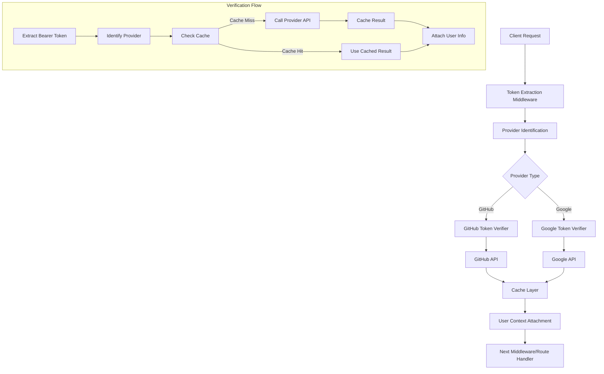

# Design Document

## Overview

This design implements OAuth token verification middleware that validates tokens directly with OAuth providers (GitHub and Google) on each request. The middleware extracts tokens from Authorization headers, identifies the provider, verifies token validity with the provider's API, and attaches user information to the request context. The solution includes caching, retry logic, and flexible configuration options for different authentication requirements.

## Architecture

### High-Level Architecture



### Technology Stack Integration

- **Express.js**: Middleware integration and request/response handling
- **Node.js HTTP Client**: Provider API calls (using built-in fetch or axios)
- **Memory Cache**: Short-term token verification caching
- **TypeScript**: Type safety for provider responses and user context
- **Error Handling**: Integration with existing AppError system

## Components and Interfaces

### 1. Token Extraction and Validation

**Token Middleware Interface:**
```typescript
interface TokenVerificationOptions {
  required?: boolean; // Default: true
  providers?: ('github' | 'google')[]; // Default: ['github', 'google']
  cacheTimeout?: number; // Default: 300 seconds (5 minutes)
  requestTimeout?: number; // Default: 5000ms
  retryAttempts?: number; // Default: 2
}

interface VerifiedUser {
  provider: 'github' | 'google';
  id: string;
  username: string;
  email?: string;
  name?: string;
  avatarUrl?: string;
}

declare global {
  namespace Express {
    interface Request {
      user?: VerifiedUser;
    }
  }
}
```

### 2. Provider-Specific Verifiers

**GitHub Token Verifier:**
```typescript
interface GitHubUserResponse {
  id: number;
  login: string;
  email?: string;
  name?: string;
  avatar_url: string;
}

class GitHubTokenVerifier {
  static async verifyToken(token: string): Promise<VerifiedUser>;
  private static async callGitHubAPI(token: string): Promise<GitHubUserResponse>;
  private static transformToVerifiedUser(githubUser: GitHubUserResponse): VerifiedUser;
}
```

**Google Token Verifier:**
```typescript
interface GoogleTokenInfoResponse {
  sub: string; // User ID
  email?: string;
  name?: string;
  picture?: string;
  aud: string; // Client ID
  exp: number; // Expiration time
}

class GoogleTokenVerifier {
  static async verifyToken(token: string): Promise<VerifiedUser>;
  private static async callGoogleTokenInfo(token: string): Promise<GoogleTokenInfoResponse>;
  private static transformToVerifiedUser(googleUser: GoogleTokenInfoResponse): VerifiedUser;
}
```

### 3. Provider Identification

**Token Pattern Matching:**
```typescript
interface ProviderPattern {
  name: 'github' | 'google';
  pattern: RegExp;
  priority: number;
}

class ProviderIdentifier {
  private static patterns: ProviderPattern[] = [
    {
      name: 'github',
      pattern: /^gh[ps]_[A-Za-z0-9_]{36,255}$/, // GitHub personal access tokens
      priority: 1
    },
    {
      name: 'google',
      pattern: /^ya29\.[A-Za-z0-9_-]+$/, // Google OAuth 2.0 access tokens
      priority: 2
    }
  ];

  static identifyProvider(token: string): 'github' | 'google' | null;
}
```

### 4. Caching Layer

**Memory Cache Implementation:**
```typescript
interface CacheEntry {
  user: VerifiedUser;
  timestamp: number;
  expiresAt: number;
}

class TokenCache {
  private static cache = new Map<string, CacheEntry>();
  
  static get(token: string): VerifiedUser | null;
  static set(token: string, user: VerifiedUser, ttl: number): void;
  static clear(): void;
  private static cleanup(): void; // Remove expired entries
}
```

## Data Models

### Verified User Model

```typescript
class VerifiedUser {
  provider: 'github' | 'google';
  id: string;
  username: string;
  email?: string;
  name?: string;
  avatarUrl?: string;

  constructor(data: Partial<VerifiedUser>) {
    Object.assign(this, data);
  }

  static fromGitHub(githubUser: GitHubUserResponse): VerifiedUser {
    return new VerifiedUser({
      provider: 'github',
      id: githubUser.id.toString(),
      username: githubUser.login,
      email: githubUser.email,
      name: githubUser.name,
      avatarUrl: githubUser.avatar_url
    });
  }

  static fromGoogle(googleUser: GoogleTokenInfoResponse): VerifiedUser {
    return new VerifiedUser({
      provider: 'google',
      id: googleUser.sub,
      username: googleUser.email?.split('@')[0] || googleUser.sub,
      email: googleUser.email,
      name: googleUser.name,
      avatarUrl: googleUser.picture
    });
  }
}
```

### HTTP Client Configuration

```typescript
interface HTTPClientConfig {
  timeout: number;
  retries: number;
  retryDelay: number;
}

class HTTPClient {
  private config: HTTPClientConfig;

  async get<T>(url: string, headers: Record<string, string>): Promise<T>;
  private async retry<T>(fn: () => Promise<T>, attempts: number): Promise<T>;
}
```

## Error Handling

### Error Types and Responses

1. **Token Extraction Errors**
   - Missing Authorization header: 401 Unauthorized
   - Invalid header format: 400 Bad Request
   - Malformed token: 401 Unauthorized

2. **Provider Identification Errors**
   - Unknown token format: 401 Unauthorized
   - Restricted provider: 403 Forbidden

3. **Verification Errors**
   - Invalid/expired token: 401 Unauthorized
   - Provider API unavailable: 503 Service Unavailable
   - Request timeout: 408 Request Timeout
   - Rate limiting: 429 Too Many Requests

4. **System Errors**
   - Cache errors: Log and continue without cache
   - Network errors: Retry with exponential backoff

### Custom Error Classes

```typescript
class TokenVerificationError extends AppError {
  constructor(message: string, statusCode: number, provider?: string) {
    super(message, statusCode);
    this.name = 'TokenVerificationError';
    this.provider = provider;
  }
}

class ProviderAPIError extends AppError {
  constructor(provider: string, originalError: Error) {
    super(`${provider} API error: ${originalError.message}`, 503);
    this.name = 'ProviderAPIError';
    this.provider = provider;
  }
}
```

## Security Considerations

### Token Security
- Tokens are never logged or stored permanently
- Cache entries are cleared on application restart
- Sensitive token data is not included in error messages

### Provider API Security
- Use HTTPS for all provider API calls
- Validate SSL certificates
- Implement rate limiting awareness

### Cache Security
- Memory-only cache (no disk persistence)
- Automatic cleanup of expired entries
- Limited cache size to prevent memory exhaustion

### Request Security
- Validate token format before API calls
- Sanitize user data from provider responses
- Implement request timeouts to prevent hanging requests

## Configuration Management

### Environment Variables

```env
# Token Verification Configuration
TOKEN_CACHE_TIMEOUT=300
TOKEN_REQUEST_TIMEOUT=5000
TOKEN_RETRY_ATTEMPTS=2

# Provider Configuration (optional - for client validation)
GITHUB_CLIENT_ID=your-github-client-id
GOOGLE_CLIENT_ID=your-google-client-id
```

### Middleware Configuration

```typescript
// Required token verification (default)
app.use('/api/protected', verifyToken());

// Optional token verification
app.use('/api/mixed', verifyToken({ required: false }));

// GitHub only
app.use('/api/github', verifyToken({ providers: ['github'] }));

// Custom cache timeout
app.use('/api/cached', verifyToken({ cacheTimeout: 600 }));
```

## API Endpoints Integration

### GitHub API Integration
- **Endpoint**: `GET https://api.github.com/user`
- **Headers**: `Authorization: Bearer {token}`
- **Response**: User profile information
- **Rate Limits**: 5000 requests/hour for authenticated requests

### Google API Integration
- **Endpoint**: `GET https://www.googleapis.com/oauth2/v1/tokeninfo?access_token={token}`
- **Alternative**: `GET https://oauth2.googleapis.com/tokeninfo?access_token={token}`
- **Response**: Token information including user details
- **Rate Limits**: Standard Google API quotas apply

## Performance Considerations

### Caching Strategy
- 5-minute default cache timeout balances security and performance
- Memory-based cache for fast access
- Automatic cleanup prevents memory leaks
- Cache key includes token hash for security

### Request Optimization
- Concurrent verification support
- Connection pooling for HTTP requests
- Timeout configuration prevents hanging requests
- Retry logic with exponential backoff

### Monitoring and Metrics
- Track cache hit/miss ratios
- Monitor provider API response times
- Log verification failure patterns
- Track memory usage of cache